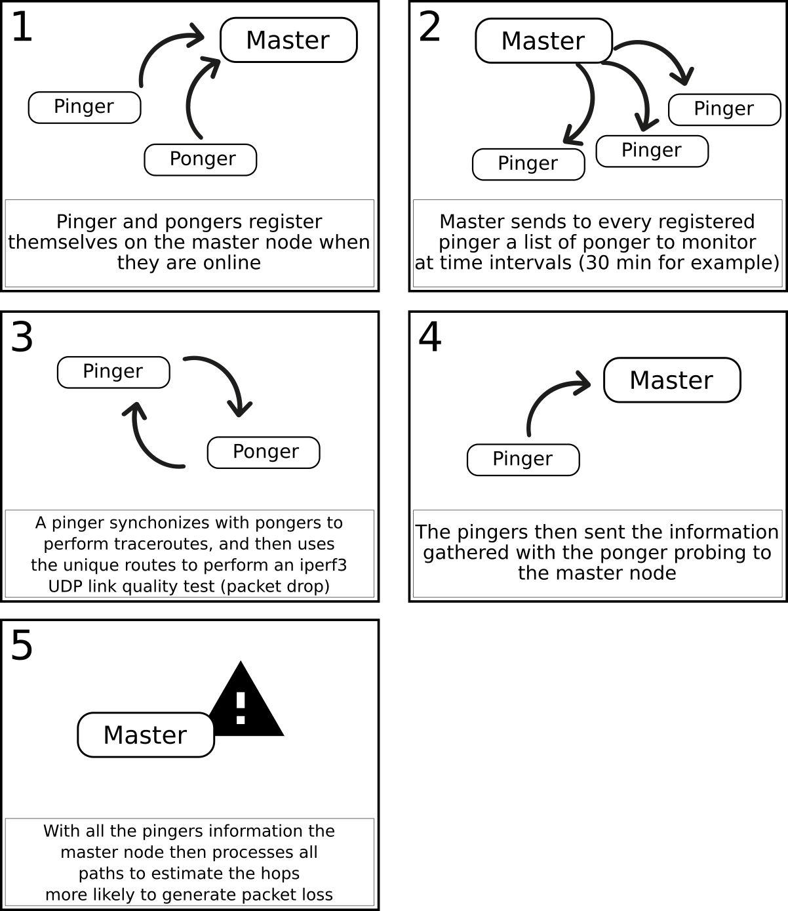
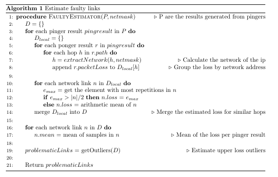
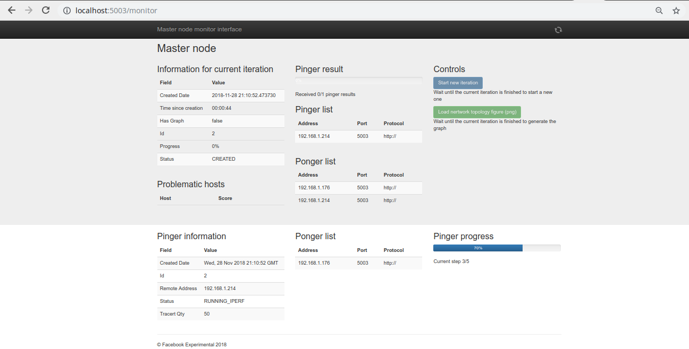
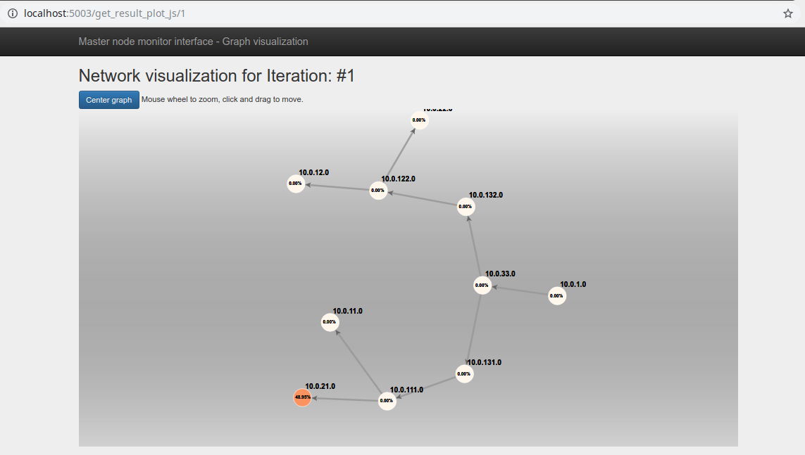

# FFS
--------

Network FFS is a sample / experimental web-system to validate network links and nodes. This tool will help you find problems in big networks easily.

### Tech

Tools used in this project:

-   dublin-traceroute
-   iperf3.1
-   python3
-   flask
-   PostgreSQL
-   Ubuntu +16

### Installation
------

Network FFS requires [Ansible](https://www.ansible.com/) 2.4+ to run. This version is more up to date than the available on the Ubuntu repositories, so please install from the Ansible repositories [Ansible repos](http://docs.ansible.com/ansible/latest/intro_installation.html#latest-releases-via-apt-ubuntu).

Configuring some parameters in the inventory file `hosts` is necessary.

Variables are used to define the server type at the `piponger_config_type`:

  - master: is a master server instance (we expect to have only one of this).
  - pinger: is the pinger server instance.
  - ponger: a ponger instance.
  - pingerponger: a server instance with the pinger and ponger capabilities.

The variables `piponger_master_host` and `piponger_master_port` must also be defined to enable synchronization among all nodes.

To install all dependencies and set up a working environment, run:

```sh
$ cd ansible_install
$ vim hosts # to edit the host's information
$ ansible-playbook -i hosts -vv playbook.yml
```

### Config file
-------

The main config file of the piponger node is called `config_default.cfg`, and after installation is located in `/srv/pipongerconfig_default.cfg`. This config file is separated in 5 sections:

```python
# ------------ #
# Basic config #
# ------------ #
API_PROTOCOL = 'http://'        # current api protocol used for this node
API_PORT = '5002'               # port currently used for this node API
DEBUG = True                    # print debug messages
MASTER_SERVER = '192.168.0.2'   # define master server host name or ip address
MASTER_PORT = '5002'            # port of the master server API
HTTP_AUTH_USER = 'user1'        # credentials for HTTP auth
HTTP_AUTH_PASS = '0000'
RESERVED_PORT_RANGE_MIN = 4000  # range for port use when assigning iperf connections
RESERVED_PORT_RANGE_MAX = 5000
IPERF3_CLIENT_SCRIPT_LOCATION = '/srv/piponger/scripts/call_iperf_client.sh'
IPERF3_SERVER_SCRIPT_LOCATION = '/srv/piponger/scripts/create_iperf_server.sh'

# ------------------------- #
# Capabilities of this node #
# ------------------------- #
IS_PINGER = True                # pinger node will generate a 'ping' like communication with the pongers
IS_PONGER = False               # a ponger will receive a pinger message and respond to it
IS_MASTER = True                # master will orchestrate pingers and pongers

# ------ #
# Celery #
# ------ #
CELERY_BROKER_URL = 'redis://localhost:6379/0'
CELERY_RESULT_BACKEND = 'redis://localhost:6379/0'
CELERYD_TASK_SOFT_TIME_LIMIT = 360
IPERF_HARD_TIMEOUT_SECONDS = 3660
IPERF_SOFT_TIMEOUT_SECONDS = 3600

# -------- #
# Database #
# -------- #
SQLALCHEMY_DATABASE_URI = 'postgresql:/DBUSER:DBPASS@localhost:5432/DBNAME'
SQLALCHEMY_TRACK_MODIFICATIONS = False

# ------ #
# Master #
# ------ #
MASTER_TRACERT_QTY = 200
DEFAULT_NETWORK_SEGMENTATION = 24   # 255.255.255.0
```

#### Basic config

In this section, the basic parameters to run this node are defined

- `API_PROTOCOL`: current protocol used in this node. This generally is http://.
- `API_PORT`: the port used to communicate with the HTTP server of this node. Default is 5002.
- `DEBUG`: set or unset the debug variable. Used to print more information to the log server.
- `MASTER_SERVER`: address or host of the master server, responsible for coordinating the iterations.
- `MASTER_PORT`: port to communicate with the master server API.
- `HTTP_AUTH_USER`: user for the HTTP auth in this node.
- `HTTP_AUTH_PASS`: password for the HTTP auth in this node.
- `RESERVED_PORT_RANGE_MIN` and `RESERVED_PORT_RANGE_MAX`: port range for the piponger functions. This port range must be available as its generally used by the open iperf servers.
- `IPERF3_CLIENT_SCRIPT_LOCATION`: the absolute location of the iperf3 script. After installation it will be at `/srv/piponger/scripts/call_iperf_client.sh`.
- `IPERF3_SERVER_SCRIPT_LOCATION`: absolute location of the iperf server script. After installation it will be at `/srv/piponger/scripts/create_iperf_server.sh`.

#### Node capabilities

This section defines the capabilities or functions of this node. A node could be a pinger, a ponger or a master.

1) *A pinger*: a node that connects to pongers to measure the network quality and to perform the network traceroutes. It must return their summarized results to the master node.
2) *A ponger*: a node that receives information and requests from the pinger. This node runs an iperf server and lets the pingers connect to it.
3) *A master server*: a node that coordinates the other nodes cyclic iterations to perform network analysis. Generally, there must be a master per network.

The parameters are boolean (True or False):

- `IS_PINGER`
- `IS_PONGER`
- `IS_MASTER`

A node could have any capabilities. A common config is to be a pinger-ponger.

#### Celery

Celery is a framework for distributed task queues [Celery](http://www.celeryproject.org/). We use Celery to make async calls to functions and to perform 'cron' like operations. Celery used redis on the backend to register the messages and function calls.

The parameters are:

- `CELERY_BROKER_URL`, the broker server URL. Default: `redis://localhost:6379/0`.
- `CELERY_RESULT_BACKEND`, the broker server URL. Default: `redis://localhost:6379/0`.
- `CELERYD_TASK_SOFT_TIME_LIMIT`, a soft limit to pervent functions hanging the server. After the timeout its raised an exception. Default to 360 seconds.
- `IPERF_HARD_TIMEOUT_SECONDS` and `IPERF_SOFT_TIMEOUT_SECONDS`, soft and hard time limits for the IPERF functions.

#### Database

The nodes run a Flask application with an SQLalchemy instance to perform Object-Relational Mappings, thus easing development and improving robustness.

- `SQLALCHEMY_DATABASE_URI`, the database URI to allow a connection.
- `SQLALCHEMY_TRACK_MODIFICATIONS`, internal SQLalchemy to improve PostgreSQL compatibility.

#### Master

The master server has only a specific parameter to config:

- `MASTER_TRACERT_QTY`, the number of dublin-traceroute paths to test. Generally, this parameter must be tuned to the size of the network (default 200 paths per test).
- `DEFAULT_NETWORK_SEGMENTATION`, the netmask of the links at the network. Helpful to group multiple hops that represent a single link (default /24).

## How piponger works?
--------

As stated before, the system is divided into 3 modules: pinger, ponger, and master. An iteration is a cycle on which the pingers and pongers synchronize to monitor the current state of the network.

- Pinger:
    - perform iperf client and dublin-traceroute requests.
    - Send reports to master.
    - Waits for master to send the list of pongers to perform the monitor iteration.
    - Register itself on master as an available pinger.

- Ponger:
    - Register itself on master as an available ponger.
    - Waits till a pinger asks for an iperf server, then create a server and return a probe port.

- Master:
    - Receive all pinger and ponger register messages.
    - At a fixed interval calls all pingers to perform a network iteration.
    - Analyse the received data from the pingers to estimate where the slow nodes are in the network.


### Sistem architecture

As observed in Figure 1, the nodes share a common base of:
- PostgreSQL database
- flask application
- celery installation

|   |
|:--:|
| *Figure 1. System arquitecture.* |

Although all nodes share the same software base, every node can be configured to allow different capabilities. This configuration enables us to add pinger capabilities for a ponger node easily or to make any arrangement with ease.

### A normal iteration of the system

A brief description of a network iteration (Figure 2):

1) The master node is UP
2) Several pingers and pongers are UP
3) Pingers and pongers register themselves on the master as available nodes.
4) A master creates a new network iteration:
    - Master defines a X number of dublin-tracerts to be performed at every node.
    - A message is sent to every pinger with the adress and config of every ponger to perform the iteration.
5) A pinger receives the iteration requests:
    - Save all iteration request from master
    - Query all pongers available for an iperf port to perform a network analysis
    - Perform X dublin-tracerts to every ponger
    - From the result of the tracerts a network topolgy can be observed and unique path/port combinations are calculated.
    - For every unique path between a pair of pinger/ponger is performed an Iperf session to measure packet loss.
    - All results are summarized and sent to the master node
6) The master node receives all the pinger results:
    - Generate a graph with the calculated paths and path quality (UDP packet loss from an Iperf3 session)
    - Faulty node estimation logic is executed (see Algorithm 1)
    - The computed outliers are saved into the database.
7) The problematic nodes of the last iteration can be easily obtained by performing a get request to the master server.

|  |
|:--:|
| *Figure 2. Simplified system function.* |

The proposed algorithm for faulty node estimation (Algorithm 1) works by first grouping the hops gathered by the traceroute into their network addresses (the network admin must manually define the network mask). Then, a voting system is performed to filter the loss results: if there is a result that dominates (more than 50% of the samples) for a given link, then this dominant result is chosen. If not, then the mean of all outcomes for a given link of a pinger is selected. After performing this step for the isolated results of every pinger, all results are merged and, the loss for every link is then calculated as the mean of the pinger results. Finally, an outlier detection algorithm is used to isolate the most likely links to be faulty.

|  |
|:--:|
| *Algorithm 1. Detection of faulty hops.* |

### The master root site

A GET request to the master API server (generally at port 5000) must be similar to:

```json
{
  "capabilities": {
    "is_master": true,
    "is_pinger": true,
    "is_ponger": false
  },
  "master_info": {
    "current_iteration": {
      "created_date": "1/1/2011 12:12:33",
      "problematic_hosts": [
        "192.168.1.2", "192.168.22.101"
      ],
     "last_iteration": {
      "created_date": "1/1/2011 10:12:33",
      "problematic_hosts": [
        "192.168.1.2"
      ]
    },
    "registrered_pingers": [],
    "registrered_pongers": []
  },
  "pinger_info": {
    "last_iteration_status": {},
    "ponger_list": []
  }
}
```

Where `capabilities` is a fixed field, and `master_info`, `pinger_info` or `ponger_info` appear according to the capabilities of the server. The latest information from a master iteration appears under the `last_iteration_status` field at the `master_info`. The last_iteration_status carries the problematic host's information that should be used to pinpoint and access the estimated bad hops at the last monitor iteration.

### Web administration

A simple web interface was added to the master node to allow start and visualize the monitor iterations (Figure 3). The monitor interface is active at the `/monitor` URL `(http://node:5003/monitor)`.
Just press 'start new iteration' button and the system will perform a new iteration. At the end of the iteration click on one of the 'load network topology' (dynamic or PNG) buttons to load a PNG image or a dynamic view in HTML/Js (Figure 4) of the network topology including the probabilities of failure for each node.

|   |
|:--:|
| *Figure 3. Web interface.* |

|   |
|:--:|
| *Figure 4. HTML visualization of the network.* |


## License
FFS is BSD licensed, as found in the LICENSE file.
